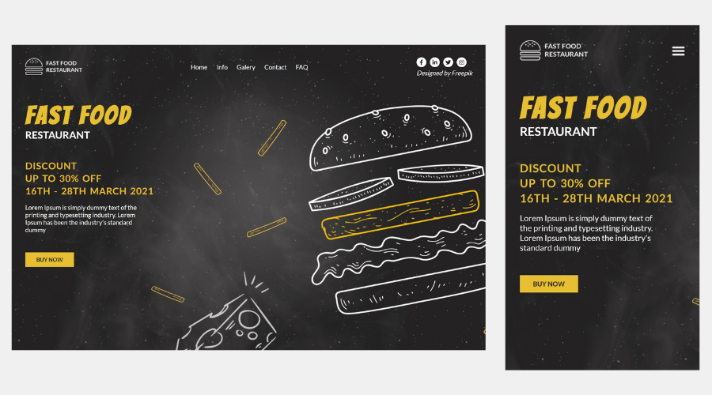

# Fast Food Restaurant

This project was inspired by the design [Fast Food Restaurant Landing Page Template](https://www.freepik.com/free-psd/fast-food-restaurant-landing-page-template_13271539.htm). Freepik provides free graphic resources (Vectors, Stock Photos and PSD).

## Table of contents

- [Overview](#overview)
  - [The challenge](#the-challenge)
  - [Screenshot](#screenshot)
  - [Links](#links)
- [My process](#my-process)
  - [Built with](#built-with)
  - [Continued development](#continued-development)
- [Author](#author)
  - [Social media](#social-media)

## Overview

### The challenge

Users should be able to:

- View the ideal layout for the website, depending on the device's screen size
- See a focus state on the desktop for the call-to-action buy now

### Screenshot

### Links

- Site URL: [https://fast-food-restaurant.netlify.app](https://fast-food-restaurant.netlify.app)

## My process

### Built with

- Semantic HTML5 markup
- CSS custom properties
- Flexbox

### Continued development

I intend to do one more project for study purposes, soon after I will focus on javascript to improve my programming skills.

## Author

### Social media

- Frontend Mentor - [ezequielsan](https://www.frontendmentor.io/profile/ezequielsan)
- Instagram - [ezequielmelo.dev](https://www.instagram.com/ezequielmelo.dev/)
- GitHub Profile - [ezequielsan](https://github.com/ezequielsan)
